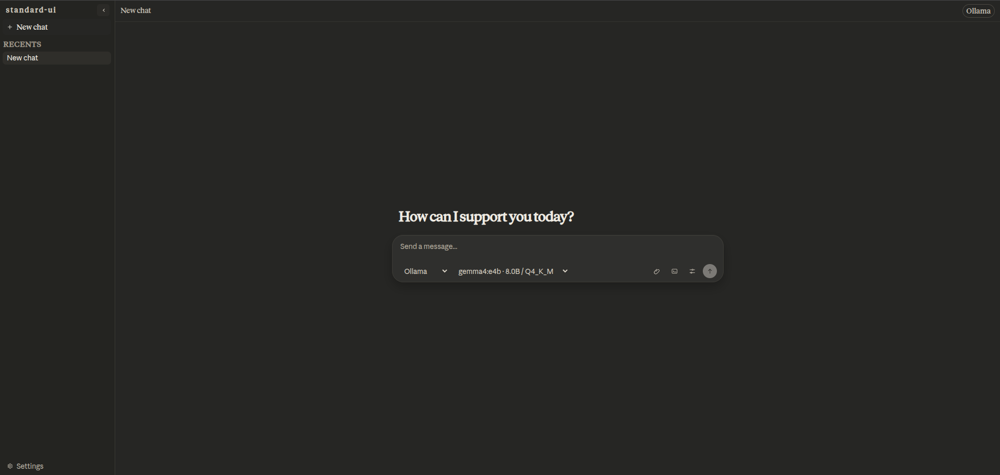

<p align="center">
  <a href="./docs/standard-ui-first-look.png">
    
  </a>
</p>

<p align="center">
  <sub>Clean chat UI with backend switcher, model picker, and local-first state built in.</sub>
</p>

<h1 align="center">standard-ui</h1>

<p align="center">
  <strong>One chat UI for OpenAI-compatible APIs, Anthropic, Ollama, and custom gateways.</strong>
</p>

<p align="center">
  Small repo. Clear data flow. Easy to fork.
</p>

<p align="center">
  <a href="https://github.com/atakang7/standard-ui/actions/workflows/ci.yml"></a>
  <a href="./LICENSE"></a>
  
  
  
</p>

<p align="center">
  <a href="#quick-start">Quick Start</a> ·
  <a href="#standard-interfaces">Standard Interfaces</a> ·
  <a href="#supported-backends">Supported Backends</a> ·
  <a href="#repo-map">Repo Map</a>
</p>

`standard-ui` gives you one chat frontend across different model backends. It keeps the UI clean, the server layer thin, and the repo easy to understand.

## Why standard-ui

- One UI for many backends.
- Local-first threads, drafts, settings, and uploads.
- Thin server routes you can actually read.
- Custom gateways without rewriting the app.
- Small enough to understand end to end.

## Quick Start

### 1. Install and run

```bash
npm install
npm run dev
```

Open `http://localhost:3000`.

### 2. Add one backend

Create a local `.env` file with only the provider you want.

Ollama:

```dotenv
OLLAMA_BASE_URL=http://localhost:11434
```

OpenAI-compatible:

```dotenv
OPENAI_ENABLED=true
OPENAI_BASE_URL=https://api.openai.com/v1
OPENAI_API_KEY=sk-...
```

Anthropic:

```dotenv
ANTHROPIC_ENABLED=true
ANTHROPIC_BASE_URL=https://api.anthropic.com/v1
ANTHROPIC_API_KEY=sk-ant-...
```

### 3. Start chatting

1. Choose a backend.
2. Pick a model.
3. Send your first prompt.

If no models show up:

- make sure the provider is running
- check the API key and base URL
- restart `npm run dev` after editing `.env`
- for Ollama, make sure you have pulled a model

### Production

```bash
npm run build
npm run start
```

## Standard Interfaces

This repo uses a small set of clear interfaces. These are the main ones.

### Provider interfaces

| Backend | Model list | Chat interface |
| --- | --- | --- |
| OpenAI-compatible | `GET /models` | `POST /chat/completions` |
| Anthropic | `GET /models` | `POST /messages` |
| Ollama | `GET /api/tags` | `POST /api/chat` |

### Custom gateway interface

Custom gateways are defined in `.standard-ui/provider-plugins.json`.

The plugin shape is defined in [`app/api/_lib/provider-plugins.ts`](./app/api/_lib/provider-plugins.ts).

Important fields:

- `baseUrl`: provider root URL
- `modelsPath`: path used to load models
- `chatPath`: path used to stream chat
- `modelsSource`: `remote` or `static`
- `streamFormat`: `ndjson`, `sse-standard`, or `openai`
- `headers`: custom request headers
- `staticModels`: fixed model list when you do not load models remotely
- `capabilities`: backend setting support
- `modelCapabilities`: input and attachment support

### Internal TypeScript interfaces

The shared app contracts live in [`lib/types.ts`](./lib/types.ts).

| Interface | Purpose |
| --- | --- |
| `BackendOption` | backend shown in the UI |
| `ModelOption` | model shown in the picker |
| `BackendsResponse` | response from `/api/backends` |
| `ModelsResponse` | response from `/api/models` |
| `RequestMessage` | message sent into the backend layer |
| `StreamChunk` | normalized streaming event |
| `ChatThread` | saved local thread |
| `ChatMessage` | saved local message |
| `ChatAttachment` | attachment metadata used by the UI |
| `ChatArtifact` | bundled prompt artifact metadata |
| `ChatSettings` | shared generation settings |

## Supported Backends

| Backend | Status | Notes |
| --- | --- | --- |
| OpenAI-compatible APIs | Built in | Works with OpenAI-style model and chat endpoints |
| Anthropic | Built in | Works with Anthropic model and messages endpoints |
| Ollama | Built in | Works with local Ollama model and chat endpoints |
| Custom gateways | Built in | Works through the local provider plugin interface |

## Repo Map

- [`app/page.tsx`](./app/page.tsx): main chat shell and local state
- [`app/api/_lib/backends.ts`](./app/api/_lib/backends.ts): backend translation layer
- [`app/api/_lib/provider-plugins.ts`](./app/api/_lib/provider-plugins.ts): custom gateway contract
- [`components/chat`](./components/chat): chat UI components
- [`docs/engineering.md`](./docs/engineering.md): contributor guide

## Docs

- [`CONTRIBUTING.md`](./CONTRIBUTING.md)
- [`docs/engineering.md`](./docs/engineering.md)
- [`SECURITY.md`](./SECURITY.md)
- [`CHANGELOG.md`](./CHANGELOG.md)

## License

MIT. See [`LICENSE`](./LICENSE).
