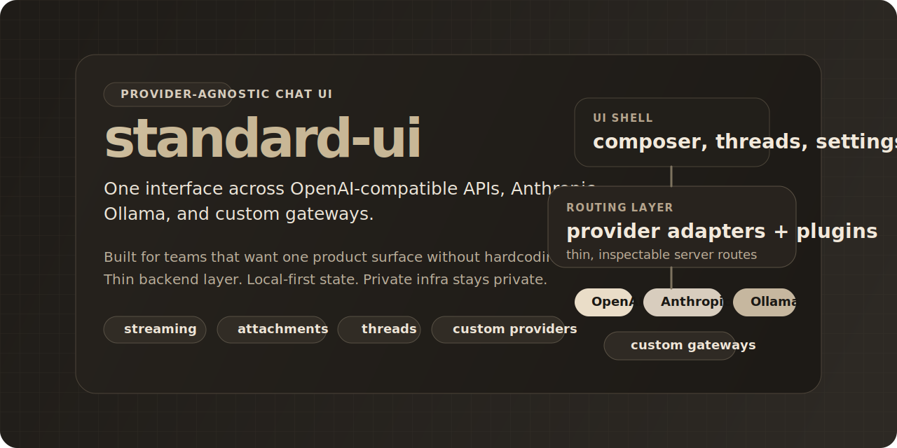

<p align="center">
  
</p>

<h1 align="center">standard-ui</h1>

<p align="center">
  Provider-agnostic chat UI for OpenAI-compatible APIs, Anthropic, Ollama, and custom gateways.
</p>

<p align="center">
  <a href="https://github.com/atakang7/standard-ui/actions/workflows/ci.yml"></a>
  <a href="./LICENSE"></a>
  
  
  
</p>

<p align="center">
  Bring your own models. Keep your own routing. Ship one UI.
</p>

`standard-ui` is for teams that want ChatGPT-class ergonomics without welding the product surface to one model vendor or one private backend. It gives you one interface across OpenAI-compatible APIs, Anthropic, Ollama, and custom provider plugins while keeping the server layer thin enough to inspect, own, and modify.

## Why This Exists

Most chat UIs force an early tradeoff:

- polished UX, but one provider
- flexible backend, but internal-only tooling
- lots of features, but lots of framework noise

`standard-ui` tries to sit in the useful middle:

- one product surface across multiple backends
- small enough to understand end to end
- practical local-first behavior instead of hidden infrastructure magic
- open-source by default, with private deployment glue kept out of the repo

## What You Get

| Capability | What it means |
| --- | --- |
| Multi-provider chat | Works with OpenAI-compatible APIs, Anthropic, Ollama, and custom provider plugins |
| Streaming-first UX | Responses stream into the UI instead of waiting for full completion payloads |
| Attachments | Handles uploads and model-aware attachment support where the backend allows it |
| Local persistence | Threads, drafts, settings, and appearance preferences stay local |
| Custom backends | Add provider plugins in `.standard-ui/provider-plugins.json` without rewriting the app shell |
| Thin server layer | API routes stay direct and inspectable instead of hiding behavior in a large backend service |

## Quick Start

```bash
npm install
npm run dev
```

Open `http://localhost:3000`.

Create a local `.env` file with only the providers you want to enable:

```dotenv
OPENAI_ENABLED=true
OPENAI_BASE_URL=https://api.openai.com/v1
OPENAI_API_KEY=sk-...

# Optional
# ANTHROPIC_ENABLED=true
# ANTHROPIC_BASE_URL=https://api.anthropic.com/v1
# ANTHROPIC_API_KEY=sk-ant-...

# Optional
# OLLAMA_BASE_URL=http://localhost:11434
```

## Supported Backends

| Backend | Status | Notes |
| --- | --- | --- |
| OpenAI-compatible APIs | Built in | Works for OpenAI-style `/models`, `/chat/completions`, and file upload flows |
| Anthropic | Built in | Supports direct Anthropic model loading and chat requests |
| Ollama | Built in | Local model workflows with model discovery and terminal integration |
| Custom gateways | Built in | Configure provider plugins locally with base URL, paths, headers, and model metadata |

## Architecture

The repo is intentionally simple:

1. [`app/page.tsx`](./app/page.tsx) owns the chat app shell, view state, drafts, and interaction flow.
2. [`app/api/_lib/backends.ts`](./app/api/_lib/backends.ts) translates the UI's request model into provider-specific calls.
3. [`app/api/_lib/provider-plugins.ts`](./app/api/_lib/provider-plugins.ts) keeps custom gateway definitions local and inspectable.
4. [`components/chat`](./components/chat) holds the product surface: composer, messages, sidebar, settings, and provider-specific UI details.

## Philosophy

- Standards over lock-in. The UI should adapt to your model stack, not force you into one vendor.
- Local-first operator control. Runtime state, drafts, uploads, and provider definitions stay under your control.
- Thin, inspectable infrastructure. You should be able to understand the whole request path without hunting through five services.
- Pragmatic open source. Private proxy helpers, secret-bearing scripts, and deployment glue stay out of the public repo.

## Docs

- [`CONTRIBUTING.md`](./CONTRIBUTING.md): practical contribution rules
- [`docs/engineering.md`](./docs/engineering.md): codebase map and engineering playbook
- [`SECURITY.md`](./SECURITY.md): how to report vulnerabilities responsibly

## Near-Term Focus

- better demo assets and screenshots
- stronger automated test coverage around provider adapters
- more polished provider plugin ergonomics
- import and export flows for threads and local state

## Non-Goals

- publishing private proxy code
- turning the backend layer into a large framework
- forcing a hosted control plane just to make the UI usable

## License

MIT. See `LICENSE`.
